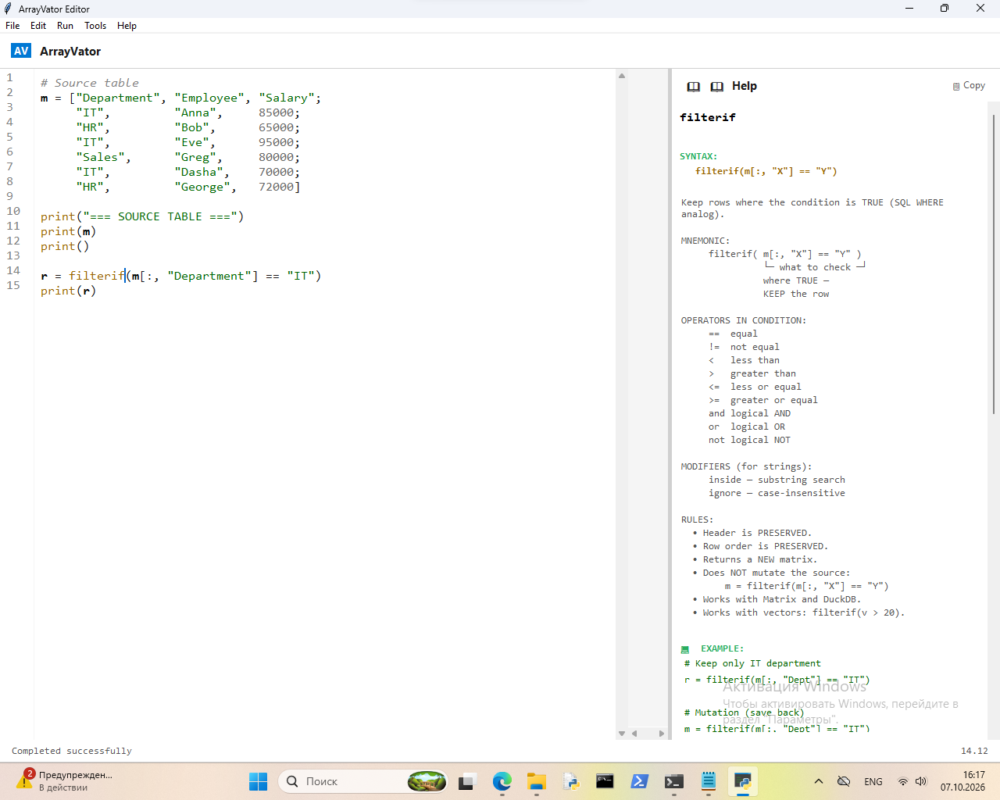
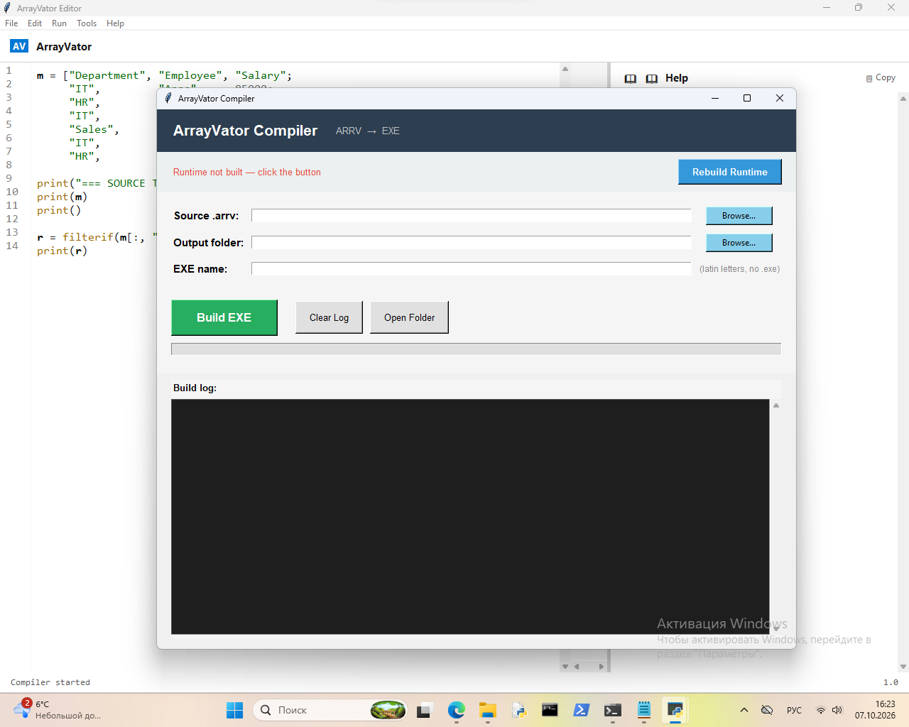
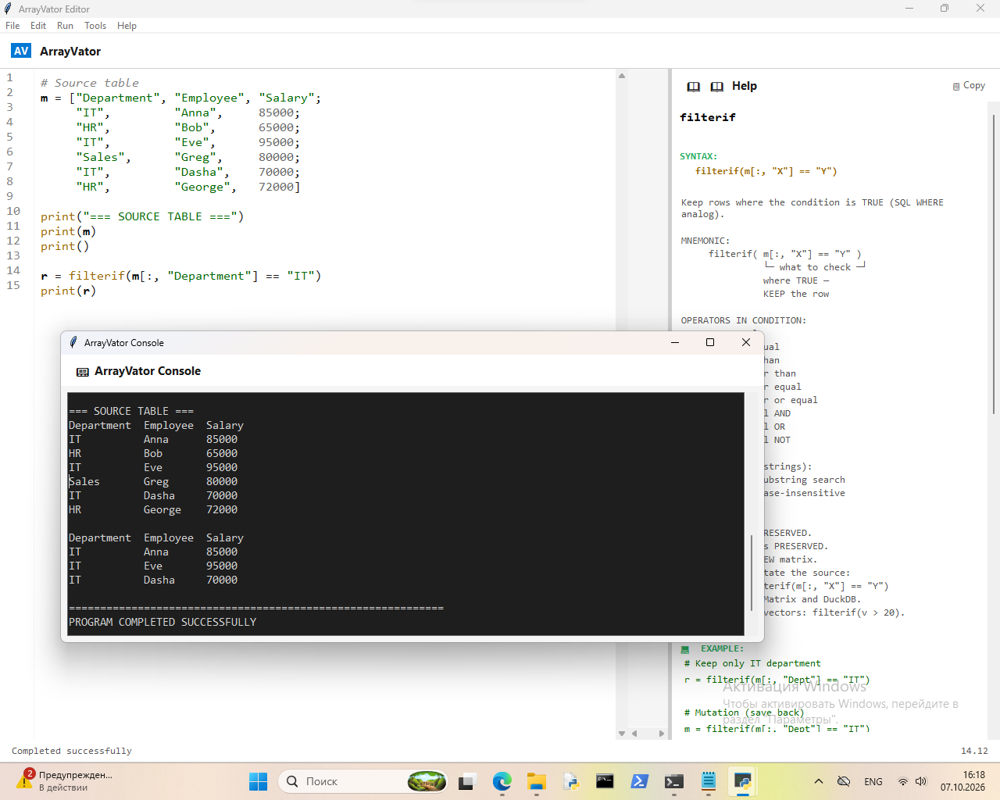

# ArrayVator

> **DSL for table data analysis** — with **2-click .exe export**.
> No Python. No PyInstaller. No dependency hell.

---

## What is ArrayVator?

ArrayVator is a **domain-specific language** for analyzing table data.
You write in a readable syntax and get results like from SQL + Python +
Excel — without needing to know all three.

**Key ideas:**

- 📊 **Table operations** — matrices, vectors, slices
- 🚀 **Two engines** — Matrix (RAM) and DuckDB (Big Data)
- 🧠 **Smart help** — autocomplete + built-in help panel
- 💬 **Clear errors** — with hints on how to fix
- ⚡ **2-click .exe export** — package your script into a standalone executable

---

## 🚀 Killer feature: 2-click .exe

Write your script → press **Tools → Export to EXE** → get a standalone `.exe`.

That's it. No Python, no PyInstaller, no `.spec` files, no DLL hunting.

### How to use the compiler

1. **Save your code** as `.arrv` in the editor (**Ctrl+S**)
2. Open **Tools → Export to EXE** — the compiler window opens
3. In the compiler:
   - **Source .arrv:** — choose your saved `.arrv` file (**Browse...**)
   - **Output folder:** — choose where to save the `.exe` (**Browse...**)
   - **EXE name:** — type a name (latin letters, no `.exe` suffix)
4. Click **Build EXE** (green button)
5. **Done!** Your standalone `.exe` is ready

> 💡 **First time?** Click **Rebuild Runtime** first — the compiler
> will prepare the runtime files. After that, builds take seconds.

### Why it matters

If you've ever tried to package a Python script into a `.exe`,
you know the pain:

- `pip install pyinstaller`
- Write a `.spec` file
- Handle missing modules with `--hidden-import`
- Copy DLLs manually
- Debug mysterious errors like `ModuleNotFoundError` in frozen builds
- Hope it works on the target machine

**ArrayVator does all of this for you.**

| Traditional Python | ArrayVator |
|---|---|
| Install Python | ❌ Not needed |
| Install PyInstaller | ❌ Not needed |
| Write `.spec` files | ❌ Not needed |
| Handle `--hidden-import` | ❌ Not needed |
| Bundle DLLs | ❌ Not needed |
| **Result** | **Standalone `.exe` in 2 clicks** |

### Automatic runtime selection

The compiler scans your code and picks the right runtime:

- **`runner_minimal`** — pure language (fastest, smallest)
- **`runner_data`** — with Excel / CSV / DuckDB
- **`runner`** — full: charts + HTML reports

---

## ✨ Features

- ⚡ **Build `.exe` in 2 clicks** — no Python, no PyInstaller
- 📊 **Matrices and vectors** — tables with headers, slicing, ranges
- 🔍 **Filtering** — `filterif`, `deleteif` vs classic loops
- 📈 **Aggregates** — `sum`, `avg`, `min`, `max`, `count`, `median`, `std`
- 🎯 **Conditional aggregates** — `sumif`, `countif`, `avgif`, `minif`, ...
- 📊 **Grouping** — `groupby`, `pivot`, `groupagg`
- 🪟 **Window functions** — `rownumber`, `rank`, `lag`, `lead`, `winsum`, `qualify`
- 📅 **Dates and time** — `year`, `adddays`, `DateDiff`, `datetrunc`
- 🧮 **Strings** — `split`, `joinvector`, `replacetext`, `clean`, `trim`
- 🔎 **Search** — `find`, `vlookup`
- 🎨 **Conditions** — `case`, `applyif`
- 🚀 **BigData** — up to 1 billion rows via DuckDB
- 📉 **Charts** — Matplotlib / Plotly (bar, line, pie, hist, scatter, box, heatmap, pair)
- 📄 **HTML reports** — with interactive Plotly charts
- 📁 **Files** — Excel, CSV, TXT, Parquet, SQLite
- 🧠 **Built-in help** — click on a function → help appears on the right

---

## 📥 Download

Get the latest portable build: [**Releases**](https://github.com/Arrayvator/arrayvator/releases/latest)

**Windows** — `ArrayVator_Portable.zip`:

- **`ArrayVator.exe`** — editor (double-click to run)
- **`runner/`** — full interpreter (DuckDB, Excel, charts)
- **`runner_data/`** — data mode (DuckDB, Excel, no charts)
- **`runner_minimal/`** — minimal (core only)
- **`compiler/`** — EXE compiler (GUI)
- **`help/`** — help files (Russian + English)

**No Python required!** Works on Windows 10/11 (x64).

**Installation:**

1. Download `ArrayVator_Portable.zip`
2. Extract anywhere
3. Run `ArrayVator.exe`

### ⚠️ First run on Windows

ArrayVator is currently **unsigned**. Windows SmartScreen may warn:

> Windows protected your PC

**This is normal.** Click **More info** → **Run anyway**.

The source is **100% open** — verify on GitHub, or build from source.

We're applying for a free open-source code-signing certificate
(via [SignPath.io](https://signpath.io/)). Future releases will be signed.

---

## 🖼 Screenshots

### Editor with built-in help

### Help panel — click any function

### 2-click `.exe` export

---

## 🚀 Quick Start

